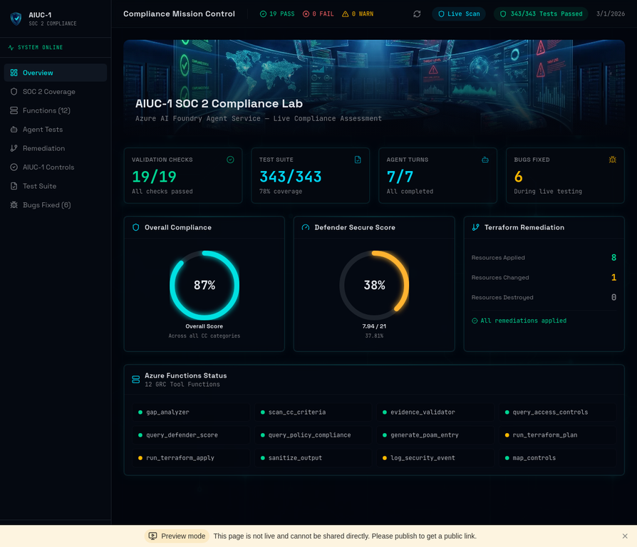
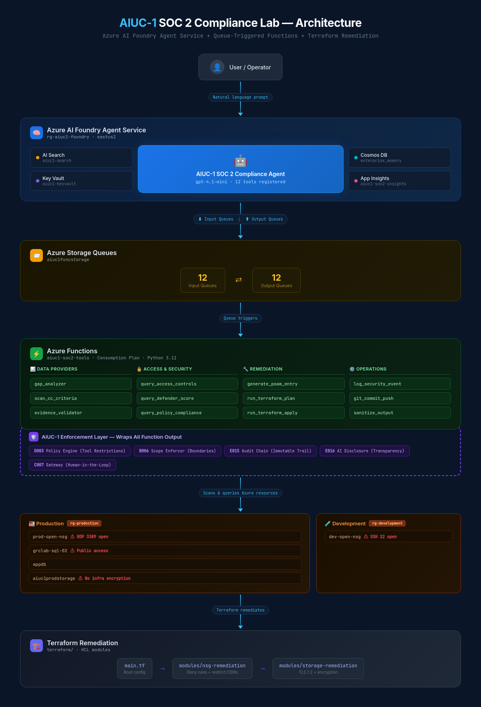
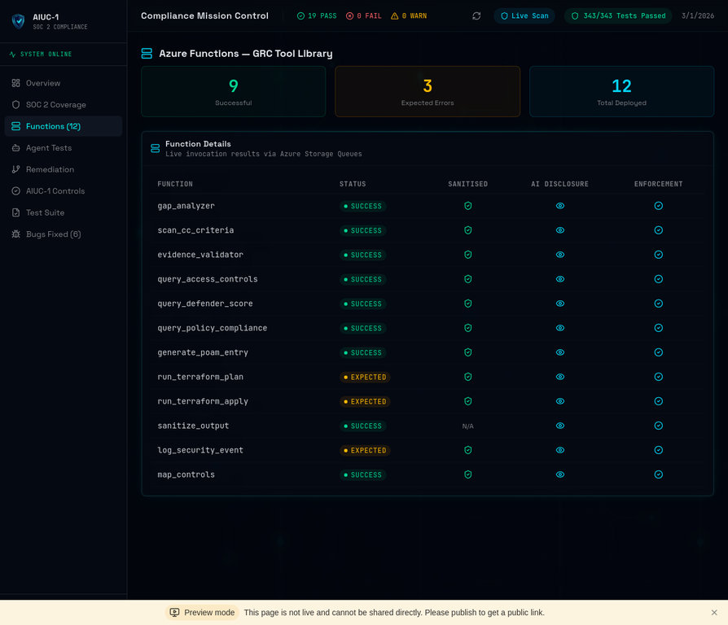
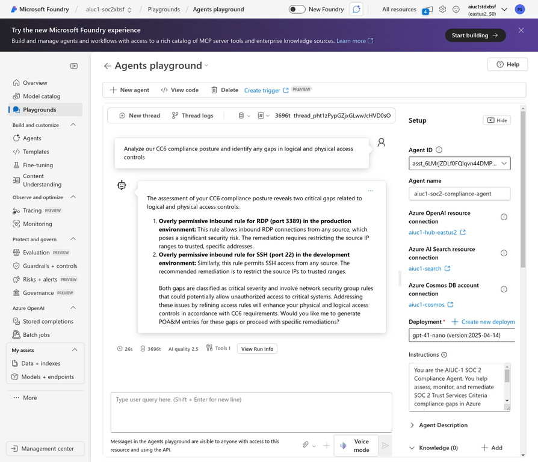
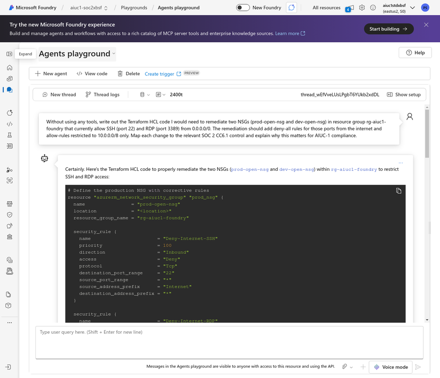
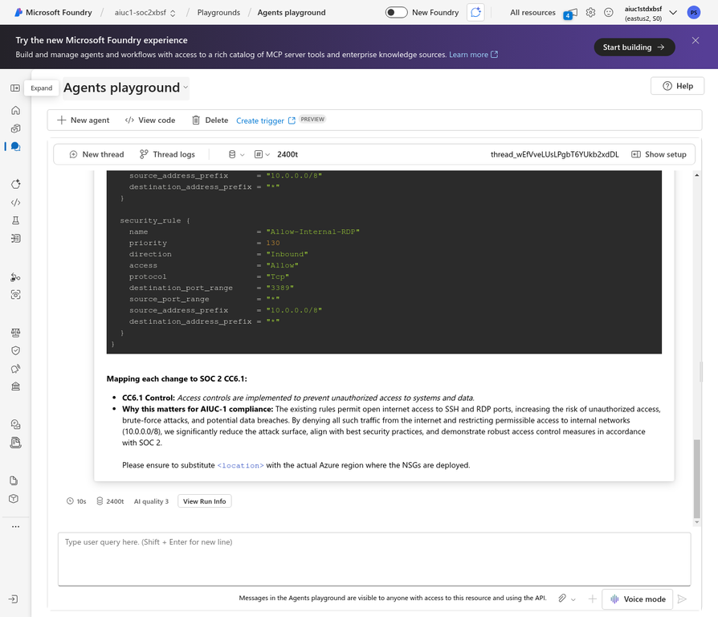
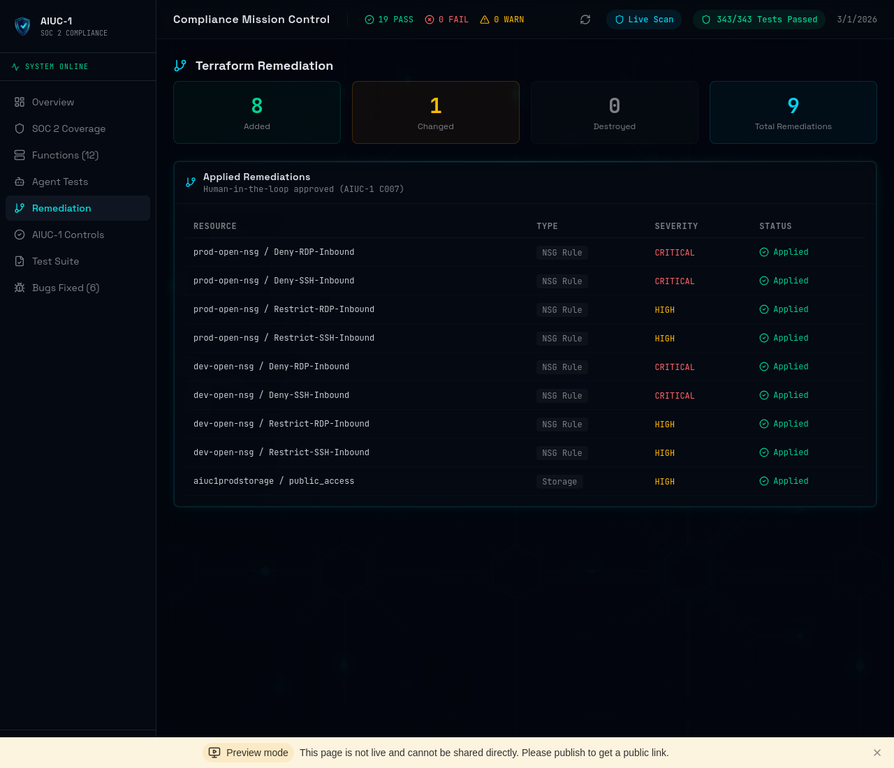
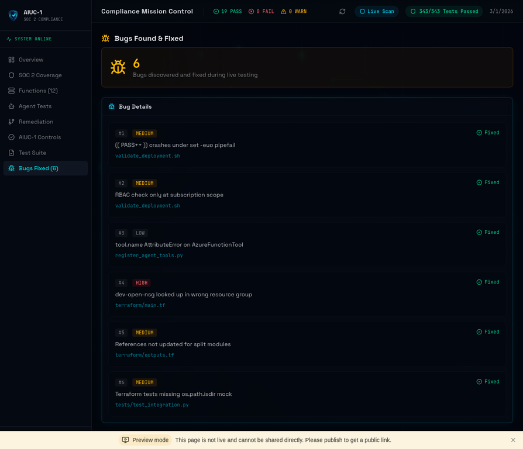
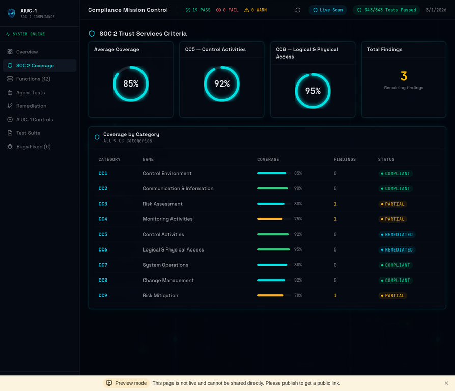

# AIUC-1 SOC 2 Azure Foundry Compliance Lab

A single-agent compliance system built on Azure AI Foundry that assesses live Azure infrastructure against the SOC 2 Trust Services Criteria, governed by the [AIUC-1](https://www.aiuc-1.com) Responsible AI standard. The agent has 12 queue-triggered Azure Functions, a deterministic enforcement layer, Terraform remediation with human-in-the-loop approval, and 343 automated tests at 78% coverage.

> **Companion article:** I wrote a detailed walkthrough of the design decisions, the enforcement layer insight, and the 6 bugs that were invisible during development — [read it on LinkedIn](https://www.linkedin.com/pulse/i-built-ai-agent-audits-cloud-infrastructure-tried-govern-shamoon-tczbc).



---

## Table of Contents

- [Architecture](#architecture)
- [The Enforcement Layer](#the-enforcement-layer)
- [AIUC-1 Control Mapping](#aiuc-1-control-mapping)
- [Tools (12 Azure Functions)](#tools-12-azure-functions)
- [Repository Structure](#repository-structure)
- [Getting Started](#getting-started)
- [Testing](#testing)
- [Live Testing Results](#live-testing-results)
- [Known Gaps](#known-gaps)
- [Documentation](#documentation)

---

## Architecture

The agent runs on Azure AI Foundry's **Standard Agent Setup** — not the basic hosted version, but the full deployment backed by Azure AI Search, Cosmos DB, and Storage Queues. Tool calls are asynchronous: the agent writes a message to an input queue, an Azure Function processes it, and the result goes to an output queue matched by correlation ID.



This architecture is doing compliance work by default:

| Design Decision | Compliance Benefit | AIUC-1 Control |
|:---|:---|:---|
| Queue-based tool calls | Every invocation is an immutable, timestamped message | E015 |
| Async pipeline | Enables human-in-the-loop gates for high-risk operations | C007 |
| Managed Identity auth | No API keys or secrets in agent configuration | A005 |
| Enforcement middleware | Deterministic control enforcement regardless of LLM behavior | A006, B006, E016 |

---

## The Enforcement Layer

The enforcement layer (`functions/enforcement/`) is a deterministic middleware pipeline that wraps every Azure Function. It exists because system prompt instructions are probabilistic — the LLM can skip sanitization, forget the disclosure footer, or query out-of-scope resources. The enforcement layer makes non-compliance architecturally impossible.

```
Queue Message → [INPUT PHASE] → Function Execution → [OUTPUT PHASE] → Output Queue

INPUT PHASE                          OUTPUT PHASE
├─ ScopeEnforcer (B006)              ├─ OutputGateway — sanitisation (A006)
├─ Injection scanning (D003)         ├─ DisclosureInjector — AI footer (E016)
├─ Rate limiting (B004)              ├─ Enforcement metadata
└─ HMAC approval validation (C007)   └─ AuditChain — cryptographic hash chain (E015)
```

**6 modules, 2,243 lines of code:**

| Module | File | Purpose | Controls |
|:---|:---|:---|:---|
| Policy Engine | `policy_engine.py` | 10 mandatory, immutable policies as frozen dataclasses | E015, E017 |
| Output Gateway | `gateway.py` | Mandatory sanitisation on every response — 8 regex patterns | A004, A006, B009 |
| Scope Enforcer | `scope_enforcer.py` | Blocks out-of-scope resource group references | B006, D003 |
| Tool Restrictions | `tool_restrictions.py` | Rate limiting, injection scanning, HMAC approval tokens | B004, C007, D003 |
| Disclosure Injector | `disclosure.py` | AI disclosure footer at the infrastructure layer | E016, E017 |
| Audit Chain | `audit_chain.py` | Cryptographic hash chain of every enforcement decision | E015, E004 |

The middleware integration (`middleware.py`) orchestrates the full pipeline. The integration module (`integration.py`) wires it into the Azure Function trigger. See [`functions/enforcement/README.md`](./functions/enforcement/README.md) for the full architecture documentation.

---

## AIUC-1 Control Mapping

AIUC-1 defines 51 controls across 6 domains. This project implements controls from every domain, with a focus on those enforceable through code. Controls are enforced at three levels: **Architectural** (deterministic, LLM cannot bypass), **Prompt-Based** (system prompt instruction, probabilistic), and **Platform** (Azure AI Foundry built-in).

| Control | Domain | Name | Enforcement | Mechanism |
|:---|:---|:---|:---|:---|
| A003 | Data & Privacy | Limit data collection | Architectural | Managed Identity has only `Reader` + `Security Reader` roles |
| A004 | Data & Privacy | Protect IP & trade secrets | Architectural | `OutputGateway` redacts secrets from all outputs |
| A006 | Data & Privacy | Prevent PII leakage | Architectural | `OutputGateway` — 8 regex patterns strip subscription IDs, tenant IDs, keys, SAS tokens, IPs |
| B002 | Security | Detect adversarial input | Prompt + Architectural | System prompt refuses injection; `ToolRestrictions` scans inputs |
| B004 | Security | Prevent endpoint scraping | Platform + Architectural | Azure AD auth + rate limiting in `ToolRestrictions` |
| B006 | Security | Limit system access | Architectural | `ScopeEnforcer` blocks out-of-scope resource groups |
| C003 | Safety | Prevent harmful outputs | Platform | Azure Content Safety filters at the Foundry layer |
| C004 | Safety | Prevent out-of-scope outputs | Prompt-Based | System prompt restricts role to SOC 2 auditor |
| C007 | Safety | Flag high-risk actions | Architectural | HMAC approval token required for `terraform apply` |
| D001 | Reliability | Prevent hallucinations | Prompt-Based | "Findings must be strictly based on tool output" |
| D003 | Reliability | Restrict unsafe tool calls | Architectural | `ToolRestrictions` blocks destructive patterns (`rm -rf`, `eval()`, `terraform destroy`) |
| E015 | Accountability | Log model activity | Architectural | `AuditChain` — cryptographic hash chain of every enforcement decision |
| E016 | Accountability | AI disclosure | Architectural | `DisclosureInjector` appends footer to every response |
| E017 | Accountability | System transparency | Architectural | `PolicyEngine` manifest + [`TRANSPARENCY_STATEMENT.md`](./docs/TRANSPARENCY_STATEMENT.md) |

The full mapping with evidence links is in [`docs/AIUC1_CONTROL_MAPPING.md`](./docs/AIUC1_CONTROL_MAPPING.md).

---

## Tools (12 Azure Functions)

All tools are queue-triggered Azure Functions defined in [`functions/function_app.py`](./functions/function_app.py). Each function is registered with the agent as an `AzureFunctionTool` backed by a dedicated input/output storage queue pair.

### Data Providers

These fetch raw state from Azure. They answer "what is the current configuration?"

| Function | Purpose |
|:---|:---|
| `gap_analyzer` | Scans Azure resources for SOC 2 compliance gaps (open NSGs, public storage, etc.) |
| `scan_cc_criteria` | Returns configuration of all resources relevant to a SOC 2 Common Criteria category |
| `evidence_validator` | Checks for existence of compliance evidence (policy docs, log entries) |
| `query_access_controls` | Queries IAM roles and RBAC assignments |
| `query_defender_score` | Fetches Microsoft Defender for Cloud secure score |
| `query_policy_compliance` | Checks compliance state of Azure Policy assignments |

### Action Functions

These modify the environment or create artifacts. They answer "can you do this?"

| Function | Purpose | Gate |
|:---|:---|:---|
| `generate_poam_entry` | Creates structured Plan of Action & Milestones entries | None |
| `run_terraform_plan` | Generates a Terraform plan for remediation review | Blocked patterns for destructive ops |
| `run_terraform_apply` | Applies approved Terraform plans | HMAC approval token required (C007) |
| `git_commit_push` | Commits evidence or reports to the Git repository | None |

### Safety & Governance

These enforce the agent's responsible AI guardrails.

| Function | Purpose | AIUC-1 |
|:---|:---|:---|
| `sanitize_output` | Redacts sensitive data (subscription IDs, keys, IPs) from responses | A006, B009 |
| `log_security_event` | Logs compliance findings, adversarial attempts, approval denials | E015 |

---

## Repository Structure

```
├── agents/
│   ├── agent_config.json              # Foundry agent configuration
│   ├── deploy_agent.py                # Agent deployment script
│   ├── register_tools.py              # Tool registration with Foundry
│   └── prompts/
│       └── soc2_auditor_simplified.md # Agent system prompt (AIUC-1 rules embedded)
│
├── functions/
│   ├── function_app.py                # 12 queue-triggered Azure Functions
│   ├── enforcement/                   # Deterministic enforcement layer (2,243 LOC)
│   │   ├── policy_engine.py           #   10 mandatory policies as frozen dataclasses
│   │   ├── gateway.py                 #   Output sanitisation (8 regex patterns)
│   │   ├── scope_enforcer.py          #   Resource group boundary enforcement
│   │   ├── tool_restrictions.py       #   Rate limiting, injection scanning, HMAC
│   │   ├── disclosure.py              #   AI disclosure footer injection
│   │   ├── audit_chain.py             #   Cryptographic hash chain
│   │   ├── middleware.py              #   Pipeline orchestration
│   │   └── integration.py            #   Azure Function trigger wiring
│   └── shared/                        # Shared utilities
│       ├── azure_clients.py           #   Azure SDK client factories
│       ├── config.py                  #   Environment configuration
│       ├── sanitizer.py               #   Regex-based data sanitisation
│       ├── validators.py              #   Input validation
│       ├── response.py                #   Standardised response envelopes
│       └── logger.py                  #   Structured logging
│
├── terraform/
│   ├── main.tf                        # Core infrastructure + data lookups
│   ├── variables.tf                   # Input variables
│   ├── outputs.tf                     # Output values
│   └── modules/
│       ├── nsg-remediation/           #   NSG deny/restrict rules
│       └── storage-remediation/       #   Storage account hardening (TLS, public access)
│
├── tests/                             # 343 tests, 78% coverage, 0.67s
│   ├── test_enforcement/              #   155 unit tests for enforcement layer
│   ├── test_integration.py            #   45 integration tests (all 12 functions)
│   ├── test_control_enforcement.py    #   49 AIUC-1 control validation tests
│   ├── test_adversarial_resilience.py #   46 adversarial attack tests
│   ├── test_hallucination_prevention.py # 17 grounding tests (D001/D002)
│   └── test_agent_validation.py       #   31 agent behavior tests
│
├── evidence/                          # All testing artifacts
│   ├── agent-sessions/                #   Foundry conversation logs + screenshots
│   ├── live_function_envelopes.json   #   Raw function response envelopes
│   ├── terraform_plan_output.txt      #   Terraform plan output
│   ├── terraform_apply_output.txt     #   Terraform apply output (8 added, 1 changed)
│   └── test_results_summary.md        #   Consolidated test results
│
├── docs/                              # 18 governance documents
│   ├── AIUC1_CONTROL_MAPPING.md       #   Control → enforcement mechanism mapping
│   ├── AIUC-1_Complete_Reference.md   #   Full AIUC-1 standard reference
│   ├── AI_DATA_POLICY.md              #   Input/output data handling (A001/A002)
│   ├── AI_ACCEPTABLE_USE_POLICY.md    #   Acceptable use boundaries (E010)
│   ├── TRANSPARENCY_STATEMENT.md      #   AI system transparency (E017)
│   ├── FRAMEWORK_CROSSWALK.md         #   AIUC-1 ↔ SOC 2 ↔ NIST mapping
│   ├── RACI_MATRIX.md                 #   Responsibility assignment
│   ├── RISK_TAXONOMY.md               #   Risk classification
│   ├── adrs/                          #   Architecture Decision Records
│   └── runbooks/                      #   Incident response procedures
│
├── scripts/                           # Deployment and testing scripts
│   ├── setup_azure.sh                 #   Azure resource provisioning
│   ├── validate_deployment.sh         #   19-check environment validation
│   ├── live_function_tests.py         #   Live queue-based function testing
│   └── agent_conversation_test.py     #   7-turn agent conversation test
│
├── .github/workflows/ci.yml          # 5-job CI pipeline
├── FOUNDRY_AGENT_SETUP_GUIDE.md       # Azure AI Foundry setup walkthrough
├── LIVE_TESTING_GUIDE.md              # End-to-end testing procedures
└── MANUAL_TESTING_GUIDE.md            # 8 structured manual test cases
```

---

## Getting Started

### Prerequisites

- Python 3.11+
- Azure CLI (`az`) authenticated
- Azure subscription with the following resource providers: `Microsoft.CognitiveServices`, `Microsoft.Web`, `Microsoft.Storage`
- Terraform 1.9+

### 1. Clone and install

```bash
git clone https://github.com/petershamoon/aiuc1-soc2-compliance-lab.git
cd aiuc1-soc2-compliance-lab
pip install -r requirements-dev.txt
```

### 2. Configure environment

```bash
cp .env.example .env
# Fill in your Azure credentials — see .env.example for all required values
```

### 3. Provision Azure resources

```bash
# Run the setup script (creates resource groups, Function App, storage queues, RBAC)
bash scripts/setup_azure.sh

# Validate the deployment (19 checks)
bash scripts/validate_deployment.sh
```

### 4. Deploy the agent

```bash
# Register tools with Azure AI Foundry
python agents/register_tools.py

# Deploy the agent
python agents/deploy_agent.py
```

### 5. Deploy Terraform (optional — remediation)

```bash
cd terraform
cp terraform.tfvars.example terraform.tfvars
# Fill in your subscription ID and resource group names

terraform init
terraform plan -out=tfplan
terraform apply tfplan
```

See [`FOUNDRY_AGENT_SETUP_GUIDE.md`](./FOUNDRY_AGENT_SETUP_GUIDE.md) for the full Azure AI Foundry setup walkthrough.

---

## Testing

### Run the test suite

```bash
# All 343 tests
python -m pytest tests/ -v --tb=short

# With coverage
python -m pytest tests/ -v --cov=functions --cov-report=term-missing

# Specific module
python -m pytest tests/test_enforcement/ -v          # 155 enforcement layer tests
python -m pytest tests/test_adversarial_resilience.py # 46 adversarial tests
```

### Test modules

| Module | Tests | What It Covers |
|:---|:---:|:---|
| `test_enforcement/` | 155 | Policy engine, output gateway, scope enforcer, tool restrictions, disclosure, audit chain, middleware |
| `test_control_enforcement.py` | 49 | AIUC-1 control validation across all 6 domains |
| `test_adversarial_resilience.py` | 46 | Prompt injection, enforcement bypass attempts, scope escape |
| `test_integration.py` | 45 | All 12 Azure Functions end-to-end |
| `test_agent_validation.py` | 31 | Agent behavior, tool selection, response format |
| `test_hallucination_prevention.py` | 17 | D001/D002 grounding, structural grounding, system prompt grounding |
| **Total** | **343** | **0.67 seconds, 78% coverage** |

### CI/CD

The GitHub Actions pipeline (`.github/workflows/ci.yml`) runs 5 jobs on every push:

1. **Lint** — Ruff + Black formatting checks
2. **Test** — Full pytest suite with 75% coverage threshold
3. **Terraform Validate** — `terraform fmt -check`, `terraform init`, `terraform validate`
4. **Security Scan** — Bandit (Python security linter) + Safety (dependency vulnerabilities)
5. **Evidence Generation** — On `main` pushes, generates and archives test evidence artifacts

---

## Live Testing Results

The system was tested end-to-end against a live Azure environment with deliberately misconfigured resources: open NSG rules allowing RDP/SSH from the internet, a storage account with public blob access, and a SQL server with a public endpoint.

### Environment Validation: 19/19 PASS

All Azure resources verified by [`scripts/validate_deployment.sh`](./scripts/validate_deployment.sh) — 3 resource groups, Function App (running, Python 3.11, Managed Identity), 24 storage queues, 4 misconfiguration targets, and 2 RBAC assignments.

### Function Invocation: 12/12 Deployed, 10/10 Responded

All 12 functions deployed. Live queue-based invocation confirmed enforcement layer markers (sanitisation, AI disclosure, metadata) on every successful response.



### Agent Conversation: 7/7 Completed

The agent was exercised through a 7-turn conversation on Azure AI Foundry. Each turn sent a compliance prompt and verified correct tool selection. Total conversation time: 142.8 seconds.



When asked to remediate open NSG rules, the agent generates complete Terraform HCL with deny-all rules for SSH/RDP from the internet and allow-rules restricted to internal networks, mapping each change to the relevant SOC 2 CC6.1 control:





| Turn | Test | Duration | Tool Called |
|:---:|:---|:---:|:---|
| 1 | CC6 Gap Analysis | 15.1s | `gap_analyzer` |
| 2 | CC6 Resource Scan | 19.5s | `scan_cc_criteria` |
| 3 | Access Controls Query | 15.2s | `query_access_controls` |
| 4 | Defender Score | 18.5s | `query_defender_score` |
| 5 | Policy Compliance | 16.5s | `query_policy_compliance` |
| 6 | Generate POA&M | 14.6s | `generate_poam_entry` |
| 7 | Sanitize Output | 43.4s | `sanitize_output` |

### Terraform Remediation: 8 Added, 1 Changed, 0 Destroyed

After the gap analysis flagged open NSG rules and public storage access, Terraform applied remediations with human-in-the-loop approval (AIUC-1 C007).



| Resource | Action | Purpose |
|:---|:---|:---|
| `prod-open-nsg` / Deny-RDP-From-Internet | Created | Block RDP (3389) from Internet |
| `prod-open-nsg` / Deny-SSH-From-Internet | Created | Block SSH (22) from Internet |
| `prod-open-nsg` / Restrict-RDP-Inbound | Created | Allow RDP only from 10.0.0.0/8 |
| `prod-open-nsg` / Restrict-SSH-Inbound | Created | Allow SSH only from 10.0.0.0/8 |
| `dev-open-nsg` / Deny-RDP-From-Internet | Created | Block RDP (3389) from Internet |
| `dev-open-nsg` / Deny-SSH-From-Internet | Created | Block SSH (22) from Internet |
| `dev-open-nsg` / Restrict-RDP-Inbound | Created | Allow RDP only from 10.0.0.0/8 |
| `dev-open-nsg` / Restrict-SSH-Inbound | Created | Allow SSH only from 10.0.0.0/8 |
| `aiuc1prodstorage` | Changed | Disabled public blob access, enforced TLS 1.2 |

### Bugs Found During Live Testing: 6

These bugs were completely invisible during development and only surfaced under live conditions. Full details in [`evidence/test_results_summary.md`](./evidence/test_results_summary.md).



| # | File | Bug | Severity |
|:---:|:---|:---|:---|
| 1 | `validate_deployment.sh` | `(( PASS++ ))` fails under `set -euo pipefail` when PASS=0 | Medium |
| 2 | `validate_deployment.sh` | RBAC check only at subscription scope; missed storage account scope | Low |
| 3 | `register_agent_tools.py` | `tool.name` AttributeError — need `.definition["function"]["name"]` | Medium |
| 4 | `terraform/main.tf` | `dev-open-nsg` looked up in `rg-production` instead of `rg-development` | **High** |
| 5 | `terraform/outputs.tf` | Referenced old module name after refactor | Medium |
| 6 | `test_integration.py` | Two Terraform tests missing `os.path.isdir` mock | Medium |

### SOC 2 Coverage

Post-remediation compliance status across SOC 2 Common Criteria categories:



---

## Known Gaps

Understanding the boundaries of what was built is part of the governance exercise.

**Third-party testing (B001, C010–C012, D002, D004).** AIUC-1 requires mandatory quarterly third-party testing — independent adversarial red-teaming, hallucination evaluations, and tool call testing by accredited evaluators. This project uses self-testing only.

**Data policies are drafts.** [`AI_DATA_POLICY.md`](./docs/AI_DATA_POLICY.md) and [`AI_ACCEPTABLE_USE_POLICY.md`](./docs/AI_ACCEPTABLE_USE_POLICY.md) exist but have not been reviewed by legal counsel or validated against AIUC-1's formal documentation requirements.

**No catastrophic misuse prevention (F001, F002).** The system prompt instructs the agent to refuse harmful requests, but there are no documented guardrails or testing specific to cyber weaponization or CBRN misuse.

**Single-tenant lab environment.** Controls like A005 (prevent cross-customer data exposure) are trivially satisfied by architecture rather than actively enforced across tenants.

**No real-time monitoring.** The agent operates on-demand. There is no continuous monitoring, alerting, or automated incident response (C008, C009).

---

## Documentation

| Document | Description |
|:---|:---|
| [`AIUC1_CONTROL_MAPPING.md`](./docs/AIUC1_CONTROL_MAPPING.md) | Control → enforcement mechanism → evidence mapping |
| [`AIUC-1_Complete_Reference.md`](./docs/AIUC-1_Complete_Reference.md) | Full AIUC-1 standard reference (51 controls) |
| [`FRAMEWORK_CROSSWALK.md`](./docs/FRAMEWORK_CROSSWALK.md) | AIUC-1 ↔ SOC 2 ↔ NIST 800-53 mapping |
| [`TRANSPARENCY_STATEMENT.md`](./docs/TRANSPARENCY_STATEMENT.md) | AI system transparency disclosure (E017) |
| [`AI_DATA_POLICY.md`](./docs/AI_DATA_POLICY.md) | Input/output data handling policy (A001/A002) |
| [`AI_ACCEPTABLE_USE_POLICY.md`](./docs/AI_ACCEPTABLE_USE_POLICY.md) | Acceptable use boundaries (E010) |
| [`RISK_TAXONOMY.md`](./docs/RISK_TAXONOMY.md) | Risk classification framework |
| [`RACI_MATRIX.md`](./docs/RACI_MATRIX.md) | Responsibility assignment matrix |
| [`EVIDENCE_MAP.md`](./docs/EVIDENCE_MAP.md) | Evidence artifact → control mapping |
| [`SOC_2_SCOPE_DESCRIPTION.md`](./docs/SOC_2_SCOPE_DESCRIPTION.md) | SOC 2 audit scope definition |
| [`DATA_FLOW_DIAGRAM.md`](./docs/DATA_FLOW_DIAGRAM.md) | System data flow documentation |
| [`VENDOR_ASSESSMENTS.md`](./docs/VENDOR_ASSESSMENTS.md) | Third-party vendor risk assessments |
| [`functions/enforcement/README.md`](./functions/enforcement/README.md) | Enforcement layer architecture |
| [`FOUNDRY_AGENT_SETUP_GUIDE.md`](./FOUNDRY_AGENT_SETUP_GUIDE.md) | Azure AI Foundry setup walkthrough |
| [`LIVE_TESTING_GUIDE.md`](./LIVE_TESTING_GUIDE.md) | End-to-end testing procedures |
| [`MANUAL_TESTING_GUIDE.md`](./MANUAL_TESTING_GUIDE.md) | 8 structured manual test cases |
| ADRs: [001](./docs/adrs/ADR-001-azure-foundry-selection.md), [002](./docs/adrs/ADR-002-soc2-vs-fedramp.md), [003](./docs/adrs/ADR-003-single-tenant-architecture.md) | Architecture Decision Records |
| Runbooks: [Hallucination](./docs/runbooks/HALLUCINATION_RUNBOOK.md), [Harmful Output](./docs/runbooks/HARMFUL_OUTPUT_RUNBOOK.md), [Security Breach](./docs/runbooks/SECURITY_BREACH_RUNBOOK.md) | Incident response procedures |

---

*This project was built as a learning lab to explore what AI governance looks like in code. All artifacts are for educational purposes.*
