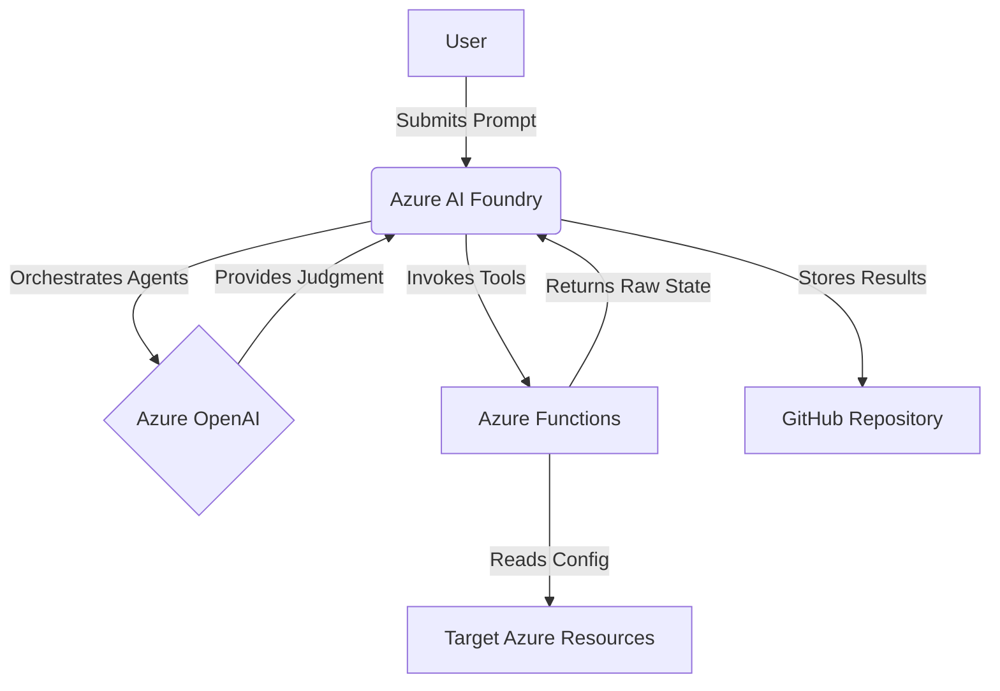

# Data Flow Diagram

This document outlines the flow of data within the AIUC-1 SOC 2 Azure Foundry Compliance Lab project, in accordance with AIUC-1 control E011. All data processing and storage occurs within the **eastus2** Azure region, with the exception of the Foundry Hub which is in **eastus**.

## High-Level Flow

The following diagram illustrates the high-level data flow:

## Detailed Flow Steps

1.  **User Input**: Pete, the user, submits a prompt to the Azure AI Foundry Agent Service to initiate a compliance assessment.
2.  **Agent Orchestration**: The Foundry service orchestrates the four GRC agents based on the user's prompt.
3.  **AI Judgment**: The agents send requests to the Azure OpenAI API to reason about compliance and generate judgments.
4.  **Tool Invocation**: The agents invoke Azure Functions to gather raw state data from the target Azure infrastructure.
5.  **Data Return**: The Azure Functions return the raw Azure resource configuration data to the agents.
6.  **Result Storage**: The agents store their findings, reports, and other outputs in the project's GitHub repository.
7.  **Configuration Reading**: The Azure Functions read the configuration of the target Azure resources to provide the necessary data to the agents.
