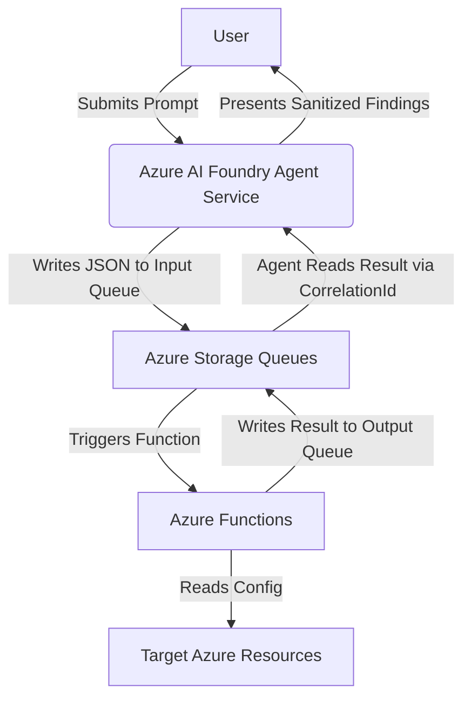

# Data Flow Diagram

This document outlines the flow of data within the AIUC-1 SOC 2 Azure Foundry Compliance Lab project, in accordance with AIUC-1 control E011. All data processing and storage occurs within the **eastus2** Azure region.

## High-Level Flow

The following diagram illustrates the high-level data flow using the queue-based tool architecture:

## Detailed Flow Steps

1.  **User Input**: Pete submits a prompt to the Azure AI Foundry Agent Service (Standard setup) to initiate a compliance assessment.
2.  **Agent Reasoning**: The SOC 2 Learning Agent (gpt-4.1-mini) reasons about which tools to invoke based on the prompt and its system prompt governance rules.
3.  **Queue Message (Input)**: The agent writes a JSON message to the appropriate input queue (e.g., `gap-analyzer-input`) in `<REDACTED-STORAGE>`. The message includes a `CorrelationId` for response matching.
4.  **Function Trigger**: The corresponding Azure Function is triggered by the new queue message. The function runs on the `aiuc1-soc2-tools` Function App (Consumption plan).
5.  **Data Collection**: The Azure Function uses its Managed Identity to read the configuration of target Azure resources (storage accounts, NSGs, SQL servers, etc.).
6.  **Queue Message (Output)**: The function writes its results to the output queue (e.g., `gap-analyzer-output`), echoing the `CorrelationId` in the response envelope.
7.  **Response Retrieval**: The agent service polls the output queue and matches the response using the `CorrelationId`.
8.  **Sanitization**: The agent calls the `sanitize_output` tool to redact sensitive information (subscription IDs, keys, etc.) before presenting results.
9.  **Final Response**: The agent synthesizes the sanitized tool output into a human-readable assessment and presents it to the user with the mandatory AI disclosure footer.

## Queue Inventory

Each of the 12 functions has a dedicated input and output queue (24 queues total) in the `<REDACTED-STORAGE>` storage account:

| Function | Input Queue | Output Queue |
|---|---|---|
| gap_analyzer | gap-analyzer-input | gap-analyzer-output |
| scan_cc_criteria | scan-cc-criteria-input | scan-cc-criteria-output |
| evidence_validator | evidence-validator-input | evidence-validator-output |
| query_access_controls | query-access-controls-input | query-access-controls-output |
| query_defender_score | query-defender-score-input | query-defender-score-output |
| query_policy_compliance | query-policy-compliance-input | query-policy-compliance-output |
| generate_poam_entry | generate-poam-entry-input | generate-poam-entry-output |
| run_terraform_plan | run-terraform-plan-input | run-terraform-plan-output |
| run_terraform_apply | run-terraform-apply-input | run-terraform-apply-output |
| git_commit_push | git-commit-push-input | git-commit-push-output |
| sanitize_output | sanitize-output-input | sanitize-output-output |
| log_security_event | log-security-event-input | log-security-event-output |
